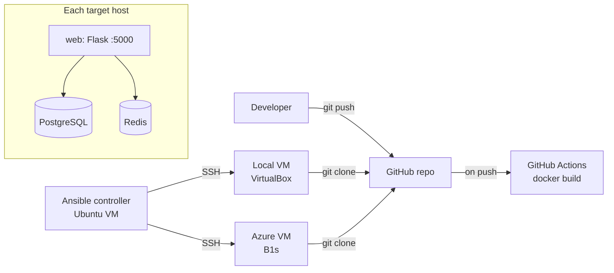

# Flask + PostgreSQL + Redis — Docker, Ansible, Azure
 
A small web application used as a hands-on DevOps project: containerized with Docker Compose, built by a CI pipeline in GitHub Actions, and deployed with Ansible to a local VM and to a cloud VM in Microsoft Azure.
 
## Tech stack
 
| Area | Tools |
|---|---|
| Application | Python, Flask |
| Data | PostgreSQL (named volume for persistence), Redis (visit counter) |
| Containers | Docker, Docker Compose |
| CI | GitHub Actions — builds the Docker image on every push to `main` |
| Configuration & deployment | Ansible |
| Cloud | Microsoft Azure — Linux VM (B1s, Ubuntu 24.04), Network Security Group |
| Automation | Bash scripts |
 
## Architecture
 

 
The three services run in one Docker Compose project and reach each other over the Compose network by service name.
 
## Project structure
 
```
.
├── app.py                  # Flask application
├── Dockerfile
├── docker-compose.yml      # web + PostgreSQL + Redis
├── project.sh              # helper script: deploy / push
├── .github/workflows/
│   └── docker-build.yml    # CI pipeline
└── ansible/
    ├── inventory.ini       # hosts: local VM and Azure VM
    ├── install-docker.yml  # installs Docker Engine from the official repo
    ├── deploy-remote.yml   # clones this repo and runs docker compose on target hosts
    └── deploy-app.yml      # runs docker compose on the controller itself
```
 
## Run locally
 
Requirements: Docker with the Compose plugin.
 
```bash
git clone https://github.com/Daswwy/flask-postgres-docker.git
cd flask-postgres-docker
docker compose up -d --build
```
 
Open http://localhost:5000
 
Stop and remove the containers (data in the PostgreSQL volume is kept):
 
```bash
docker compose down
```
 
## Deploy with Ansible
 
Target hosts are defined in `ansible/inventory.ini` (group `servers`). Connection details (IP, user, SSH key) come from `~/.ssh/config`, so the inventory only lists host aliases.
 
```bash
cd ansible
 
# 1. Install Docker on the target host(s)
ansible-playbook -i inventory.ini install-docker.yml --limit azure
 
# 2. Deploy the application
ansible-playbook -i inventory.ini deploy-remote.yml --limit azure
```
 
Drop `--limit` to run against every host in the group. The playbooks are idempotent and can be re-run safely; `deploy-remote.yml` pulls the latest code from `main` on every run.
 
## Azure setup
 
- VM: `Standard_B1s`, Ubuntu Server 24.04 LTS, 64 GiB Premium SSD (P6), SSH key authentication only
- Network Security Group: inbound SSH (22) and the application port (5000) are allowed **only from a single trusted IP address**
- Cost control: runs within the Azure free tier; a monthly budget with email alerts is configured
## What I practiced in this project
 
- Writing a Dockerfile and a multi-container Compose setup with a persistent volume
- Setting up a CI pipeline in GitHub Actions and fixing real YAML and token-scope issues
- Writing idempotent Ansible playbooks and running the same playbook against a local and a cloud host
- Creating and securing a cloud VM: SSH keys, NSG rules restricted by source IP, Azure CLI
- Troubleshooting networking: VirtualBox NAT Network and port forwarding, DNS problems blocking image pulls, firewall timeouts
## Roadmap
 
- [ ] Provision the Azure infrastructure with Terraform instead of the portal and CLI
- [ ] Run the Ansible deployment from the CI pipeline
- [ ] Put a reverse proxy (Nginx) in front of Flask
