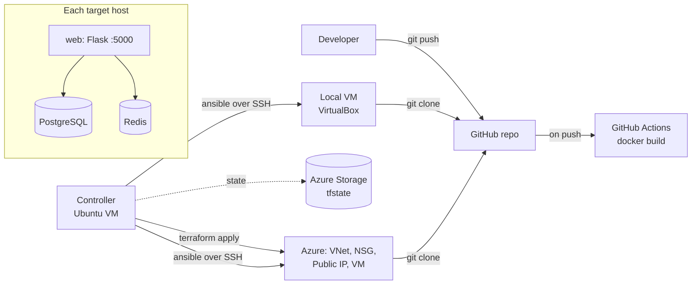

# Flask + PostgreSQL + Redis — Terraform, Ansible, Docker, Azure

A hands-on DevOps project: a small web application whose cloud infrastructure is provisioned with **Terraform**, configured and deployed with **Ansible**, containerized with **Docker Compose**, and built by a **GitHub Actions** CI pipeline. The same playbooks deploy the app to a local VM and to a VM in Microsoft Azure.

## Tech stack

| Area | Tools |
|---|---|
| Application | Python, Flask |
| Data | PostgreSQL (named volume for persistence), Redis (visit counter) |
| Containers | Docker, Docker Compose |
| Infrastructure as Code | Terraform (azurerm provider), remote state in Azure Storage |
| Configuration & deployment | Ansible |
| Cloud | Microsoft Azure — VNet, NSG, Linux VM (B1s, Ubuntu 24.04), service principal auth |
| CI | GitHub Actions — builds the Docker image on every push to `main` |
| Automation | Bash scripts |

## Architecture


```mermaid
flowchart LR
    Dev[Developer] -->|git push| GH[GitHub repo]
    GH -->|on push| CI[GitHub Actions<br/>docker build]

    Ctrl[Controller<br/>Ubuntu VM] -->|terraform apply| AZ[Azure: VNet, NSG,<br/>Public IP, VM]
    Ctrl -.->|state| ST[(Azure Storage<br/>tfstate)]
    Ctrl -->|ansible over SSH| Local[Local VM<br/>VirtualBox]
    Ctrl -->|ansible over SSH| AZ

    Local -->|git clone| GH
    AZ -->|git clone| GH

    subgraph Each target host
        W[web: Flask :5000] --> DB[(PostgreSQL)]
        W --> R[(Redis)]
    end
```

**Workflow:** `terraform apply` creates the cloud infrastructure → `ansible-playbook` installs Docker and deploys the app → the site is reachable on port 5000.

## Project structure

```
.
├── app.py                    # Flask application
├── Dockerfile
├── docker-compose.yml        # web + PostgreSQL + Redis
├── project.sh                # helper script: deploy / push
├── .github/workflows/
│   └── docker-build.yml      # CI pipeline
├── terraform/
│   ├── main.tf               # provider, remote backend, all Azure resources
│   ├── variables.tf          # input variables (e.g. trusted IP)
│   ├── outputs.tf            # public IP and ready-to-use SSH command
│   └── .terraform.lock.hcl   # pinned provider version
└── ansible/
    ├── inventory.ini         # hosts: local VM and Azure VM
    ├── install-docker.yml    # installs Docker Engine from the official repo
    ├── deploy-remote.yml     # clones this repo and runs docker compose on target hosts
    └── deploy-app.yml        # runs docker compose on the controller itself
```

Not committed (see `.gitignore`): Terraform state and plan files, `.terraform/`, `terraform.tfvars`, `.env`, private keys.

## Run locally

Requirements: Docker with the Compose plugin.

```bash
git clone https://github.com/Daswwy/flask-postgres-docker.git
cd flask-postgres-docker
docker compose up -d --build
```

Open http://localhost:5000

## Provision Azure infrastructure with Terraform

**What gets created** (resource group `rg-terraform-lab`, region Denmark East):

- Virtual network `10.10.0.0/16` with subnet `10.10.1.0/24`
- Network Security Group attached to the subnet — inbound SSH (22) and app port (5000) allowed **only from one trusted IP**
- Static Standard public IP and network interface
- Linux VM `Standard_B1s`, Ubuntu Server 24.04 LTS, 64 GiB Premium SSD, SSH key authentication only
- Common tags (`project`, `managed_by = terraform`) applied via `locals`

**State** is stored remotely in an Azure Storage container (separate resource group `rg-tfstate`), with state locking.

**Prerequisites**

1. A service principal with the Contributor role; its credentials exported as environment variables:
   ```bash
   export ARM_CLIENT_ID="..."
   export ARM_CLIENT_SECRET="..."
   export ARM_TENANT_ID="..."
   export ARM_SUBSCRIPTION_ID="..."
   ```
2. A `terraform/terraform.tfvars` file (not committed):
   ```hcl
   allowed_ip = "x.x.x.x"
   ```

**Usage**

```bash
cd terraform
terraform init      # download provider, connect remote backend
terraform plan      # preview changes
terraform apply     # create / update infrastructure
terraform output    # public IP and SSH command
```

## Deploy with Ansible

Target hosts are defined in `ansible/inventory.ini` (group `servers`). Connection details (IP, user, SSH key) come from `~/.ssh/config`, so the inventory only lists host aliases.

```bash
cd ansible

# 1. Install Docker on the target host(s)
ansible-playbook -i inventory.ini install-docker.yml --limit azure

# 2. Deploy the application
ansible-playbook -i inventory.ini deploy-remote.yml --limit azure
```

Drop `--limit` to run against every host in the group. The playbooks are idempotent and can be re-run safely; `deploy-remote.yml` pulls the latest code from `main` on every run.

## What I practiced in this project

- Writing a Dockerfile and a multi-container Compose setup with a persistent volume
- Setting up a CI pipeline in GitHub Actions and fixing real YAML and token-scope issues
- Writing idempotent Ansible playbooks and running the same playbook against a local and a cloud host
- Describing Azure infrastructure in Terraform: resource references, variables, locals, outputs
- Reading `terraform plan` (create / update in-place / replace) and catching mistakes before `apply`
- Detecting configuration drift and moving Terraform state to a remote backend
- Authenticating automation with a service principal instead of a personal account
- Migrating from a manually created VM to a fully code-defined one and decommissioning the old resources
- Troubleshooting: region/SKU restrictions, blocked device-code login, VirtualBox networking, DNS issues, firewall timeouts, LVM disk extension

## Roadmap

- [x] Provision the Azure infrastructure with Terraform
- [x] Store Terraform state remotely (Azure Storage)
- [ ] Monitoring: Prometheus + Grafana
- [ ] Run the Ansible deployment from the CI pipeline
- [ ] Reverse proxy (Nginx) with HTTPS in front of Flask
- [ ] Run the app on Kubernetes
