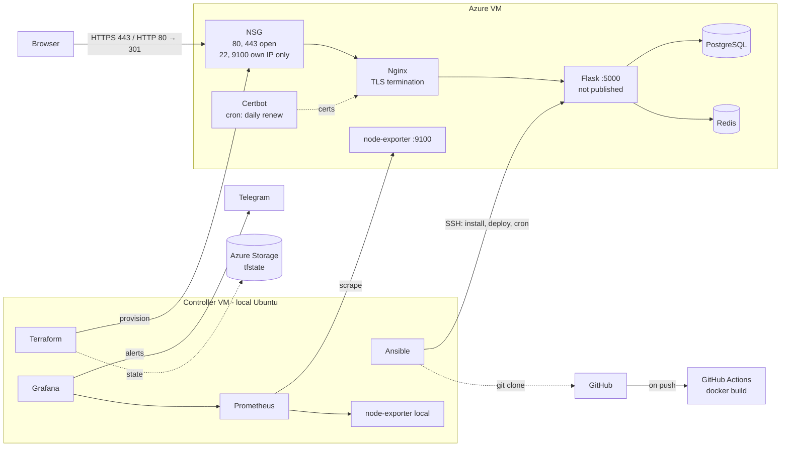

# Flask + PostgreSQL + Redis — Terraform, Ansible, Docker, Nginx, Monitoring on Azure

A hands-on DevOps project: a small web application whose cloud infrastructure is provisioned with **Terraform**, configured and deployed with **Ansible**, containerized with **Docker Compose**, served over **HTTPS** through an **Nginx** reverse proxy with a **Let's Encrypt** certificate, and monitored with **Prometheus + Grafana** with alerts to **Telegram**. A **GitHub Actions** pipeline builds the image on every push.

## Tech stack

| Area | Tools |
|---|---|
| Application | Python, Flask |
| Data | PostgreSQL (named volume for persistence), Redis (visit counter) |
| Containers | Docker, Docker Compose |
| Web / TLS | Nginx reverse proxy, Let's Encrypt (Certbot, HTTP-01 webroot), automatic renewal via cron |
| Infrastructure as Code | Terraform (azurerm provider), remote state in Azure Storage with locking |
| Configuration & deployment | Ansible (idempotent playbooks, `ansible.cfg`, inventory groups) |
| Cloud | Microsoft Azure — VNet, NSG, static public IP with DNS label, Linux VM (B1s, Ubuntu 24.04), service principal auth |
| Monitoring | Prometheus, node-exporter, Grafana (provisioned as code), Telegram alerting |
| CI | GitHub Actions — builds the Docker image on every push to `main` |
| Automation | Bash scripts |

## Architecture


```mermaid
flowchart LR
    User[Browser] -->|HTTPS 443 / HTTP 80 → 301| NSG

    subgraph Azure VM
        NSG[NSG<br/>80, 443 open<br/>22, 9100 own IP only] --> NGINX[Nginx<br/>TLS termination]
        NGINX --> WEB[Flask :5000<br/>not published]
        WEB --> DB[(PostgreSQL)]
        WEB --> R[(Redis)]
        CB[Certbot<br/>cron: daily renew] -.->|certs| NGINX
        NE1[node-exporter :9100]
    end

    subgraph Controller VM - local Ubuntu
        TF[Terraform] -->|provision| NSG
        AN[Ansible] -->|SSH: install, deploy, cron| WEB
        PROM[Prometheus] -->|scrape| NE1
        PROM --> NE2[node-exporter local]
        GRAF[Grafana] --> PROM
    end

    GRAF -->|alerts| TG[Telegram]
    TF -.->|state| ST[(Azure Storage<br/>tfstate)]
    GH[GitHub] -->|on push| CI[GitHub Actions<br/>docker build]
    AN -.->|git clone| GH
```

**Workflow:** `terraform apply` creates the cloud infrastructure → Ansible installs Docker and deploys the stack → Certbot obtains a certificate → the site is served at `https://<label>.denmarkeast.cloudapp.azure.com`. The controller VM collects metrics from all hosts and sends alerts to Telegram.

## Project structure

```
.
├── app.py                          # Flask application
├── Dockerfile
├── docker-compose.yml              # nginx + web + PostgreSQL + Redis (+ certbot as an on-demand tool)
├── nginx/
│   └── default.conf                # HTTP→HTTPS redirect, ACME challenge path, reverse proxy to Flask
├── scripts/                        # helper bash scripts (deploy / push)
├── .github/workflows/
│   └── docker-build.yml            # CI pipeline
├── terraform/
│   ├── main.tf                     # provider, remote backend, all Azure resources
│   ├── variables.tf                # input variables (trusted IP)
│   ├── outputs.tf                  # public IP, FQDN, SSH command
│   └── .terraform.lock.hcl         # pinned provider version
├── ansible/
│   ├── ansible.cfg
│   ├── inventory.ini               # hosts: local VM and Azure VM
│   ├── install-docker.yml          # Docker Engine from the official repo
│   ├── deploy-remote.yml           # clones this repo and runs docker compose
│   ├── add-swap.yml                # idempotent swap file setup
│   ├── deploy-monitoring.yml       # deploys the node-exporter agent to servers
│   └── setup-cert-renewal.yml      # installs the daily certbot renew cron job
└── monitoring/
    ├── docker-compose.yml          # Prometheus + Grafana + node-exporter (controller)
    ├── prometheus.yml              # scrape targets
    ├── agent/docker-compose.yml    # node-exporter only (monitored servers)
    └── grafana/
        ├── provisioning/           # datasource, dashboard provider, alert rules, contact point
        └── dashboards/             # Node Exporter Full dashboard (JSON)
```

Not committed (see `.gitignore`): Terraform state and plan files, `.terraform/`, `terraform.tfvars`, `.env` files (Telegram bot token), private keys. TLS certificates live only in a Docker volume on the server.

## Provision Azure infrastructure with Terraform

**What gets created** (resource group `rg-terraform-lab`, region Denmark East):

- Virtual network `10.10.0.0/16` with subnet `10.10.1.0/24`
- Network Security Group: **80 and 443 open to the Internet**; **SSH (22) and node-exporter (9100) only from one trusted IP**
- Static Standard public IP with an Azure DNS label (`<label>.denmarkeast.cloudapp.azure.com`)
- Linux VM `Standard_B1s`, Ubuntu Server 24.04 LTS, 64 GiB Premium SSD, SSH key authentication only
- Common tags (`project`, `managed_by = terraform`) applied via `locals`

**State** is stored remotely in an Azure Storage container (separate resource group `rg-tfstate`), with state locking.

**Prerequisites**

1. A service principal with the Contributor role; its credentials exported as environment variables:
   ```bash
   export ARM_CLIENT_ID="..."
   export ARM_CLIENT_SECRET="..."
   export ARM_TENANT_ID="..."
   export ARM_SUBSCRIPTION_ID="..."
   ```
2. A `terraform/terraform.tfvars` file (not committed):
   ```hcl
   allowed_ip = "x.x.x.x"
   ```

**Usage**

```bash
cd terraform
terraform init      # download provider, connect remote backend
terraform plan      # preview changes
terraform apply     # create / update infrastructure
terraform output    # public IP, FQDN, SSH command
```

## Deploy with Ansible

Hosts are defined in `ansible/inventory.ini` (group `servers`); connection details come from `~/.ssh/config`, and the inventory path is set in `ansible.cfg`.

```bash
cd ansible
ansible-playbook install-docker.yml --limit azure       # Docker Engine
ansible-playbook add-swap.yml --limit azure             # 2 GB swap for the 1 GB B1s VM
ansible-playbook deploy-remote.yml --limit azure        # pull latest code, docker compose up -d --build
ansible-playbook deploy-monitoring.yml --limit azure    # node-exporter agent
ansible-playbook setup-cert-renewal.yml                 # daily certificate renewal (cron)
```

All playbooks are idempotent and safe to re-run.

## HTTPS with Nginx and Let's Encrypt

- Nginx is the only public entry point. Flask's port is **not published** by Docker and is **closed in the NSG** (defense in depth); Nginx reaches it over the internal Docker network.
- Port 80 serves only the ACME challenge path and a `301` redirect to HTTPS.
- The certificate is obtained once with Certbot (webroot method, run as a one-off container):
  ```bash
  sudo docker compose run --rm certbot certonly \
    --webroot -w /var/www/certbot \
    -d <your-domain> \
    --register-unsafely-without-email --agree-tos
  ```
- A cron job installed by Ansible runs `certbot renew` daily and reloads Nginx without downtime.
- All services use `restart: unless-stopped`, so the stack comes back after a VM reboot.

## Monitoring and alerting

- **node-exporter** runs on every host; **Prometheus** on the controller VM scrapes them every 15 s (7-day retention).
- **Grafana is fully provisioned as code**: datasource (fixed UID), Node Exporter Full dashboard, alert rules and the Telegram contact point are loaded from `monitoring/grafana/` at startup. The bot token is injected via an environment variable from a git-ignored `.env` file. Verified by deleting the Grafana volume and starting from scratch — everything is recreated automatically.
- Alert rules: **Server down** (`up == 0` for 1 min) and **Low memory** (available memory < 15% for 5 min), delivered to Telegram.
- Prometheus and Grafana originally ran on the Azure VM but caused memory thrashing on the 1 GB B1s, which the dashboard itself revealed; they were moved to the controller, leaving only a lightweight agent on the server.

## What I practiced in this project

- Writing a Dockerfile and a multi-container Compose setup with persistent volumes and restart policies
- Setting up a CI pipeline in GitHub Actions and fixing real YAML and token-scope issues
- Writing idempotent Ansible playbooks (`stat`/`register`/`when`, `lineinfile`, `cron`) and running them against a local and a cloud host
- Describing Azure infrastructure in Terraform: resource references, variables, locals, outputs, remote state, drift detection
- Configuring Nginx as a reverse proxy with TLS, HTTP→HTTPS redirect and forwarded headers
- Issuing and auto-renewing Let's Encrypt certificates, testing safely with `--dry-run`
- Building a Prometheus + Grafana monitoring stack, writing PromQL alert rules and provisioning Grafana as code
- Keeping secrets out of Git: environment variables, `.env` files, service principal credentials
- Troubleshooting layer by layer: region/SKU restrictions, blocked device-code login, VM memory thrashing, YAML indentation errors, Nginx 404s caused by mismatched mount paths (`docker inspect`, `docker exec`, `nginx -t`, `curl`)

## Roadmap

- [x] Provision the Azure infrastructure with Terraform
- [x] Store Terraform state remotely (Azure Storage)
- [x] Monitoring: Prometheus + Grafana, alerts to Telegram
- [x] Grafana configuration as code (provisioning)
- [x] Reverse proxy (Nginx) with HTTPS and automatic certificate renewal
- [ ] Move the database password to an encrypted secret (Ansible Vault)
- [ ] Per-host Nginx config via Ansible variables (HTTP-only for the local VM)
- [ ] Refactor NSG rules into separate Terraform resources
- [ ] Run the Ansible deployment from the CI pipeline
- [ ] Run the app on Kubernetes
