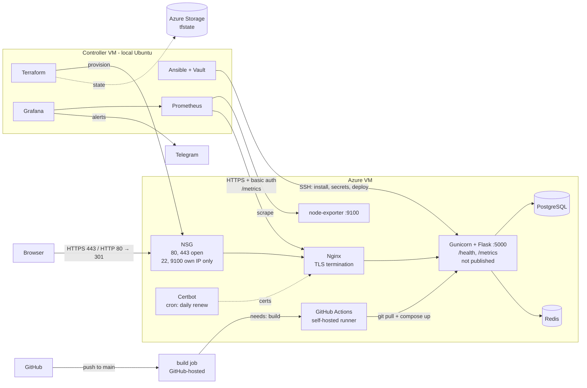

# Flask + PostgreSQL + Redis — Terraform, Ansible, Docker, Nginx, CI/CD, Monitoring on Azure

A hands-on DevOps project: a small web application whose cloud infrastructure is provisioned with **Terraform**, configured with **Ansible** (secrets in **Ansible Vault**), containerized with **Docker Compose** and served by **Gunicorn** behind an **Nginx** reverse proxy with a **Let's Encrypt** certificate. Every push to `main` is built and **automatically deployed** by **GitHub Actions** through a self-hosted runner. Host and application metrics are collected by **Prometheus**, visualized in **Grafana** and alerted to **Telegram**.

> The application itself is intentionally minimal — the focus of the project is the infrastructure, delivery pipeline and operations around it.

## Tech stack

| Area | Tools |
|---|---|
| Application | Python, Flask, Gunicorn (production WSGI server, 2 workers) |
| Data | PostgreSQL (named volume for persistence), Redis (visit counter) |
| Containers | Docker, Docker Compose, container healthchecks, restart policies |
| Web / TLS | Nginx reverse proxy, Let's Encrypt (Certbot, HTTP-01 webroot), automatic renewal via cron |
| Infrastructure as Code | Terraform (azurerm provider), remote state in Azure Storage with locking |
| Configuration & secrets | Ansible (idempotent playbooks, inventory groups), Ansible Vault for credentials |
| Cloud | Microsoft Azure — VNet, NSG, static public IP with DNS label, Linux VM (B1s, Ubuntu 24.04), service principal auth |
| CI/CD | GitHub Actions — build on every push, deploy to Azure via a self-hosted runner, post-deploy smoke test |
| Monitoring | Prometheus, node-exporter, application metrics (`prometheus_client`), Grafana (provisioned as code), Telegram alerting |

## Architecture


```mermaid
flowchart LR
    User[Browser] -->|HTTPS 443 / HTTP 80 → 301| NSG

    subgraph Azure VM
        NSG[NSG<br/>80, 443 open<br/>22, 9100 own IP only] --> NGINX[Nginx<br/>TLS termination]
        NGINX --> WEB[Gunicorn + Flask :5000<br/>/health, /metrics<br/>not published]
        WEB --> DB[(PostgreSQL)]
        WEB --> R[(Redis)]
        CB[Certbot<br/>cron: daily renew] -.->|certs| NGINX
        NE1[node-exporter :9100]
        RUN[GitHub Actions<br/>self-hosted runner]
    end

    subgraph Controller VM - local Ubuntu
        TF[Terraform] -->|provision| NSG
        AN[Ansible + Vault] -->|SSH: install, secrets, deploy| WEB
        PROM[Prometheus] -->|scrape| NE1
        PROM -->|HTTPS + basic auth<br/>/metrics| NGINX
        GRAF[Grafana] --> PROM
    end

    GRAF -->|alerts| TG[Telegram]
    TF -.->|state| ST[(Azure Storage<br/>tfstate)]
    GH[GitHub] -->|push to main| CI[build job<br/>GitHub-hosted]
    CI -->|needs: build| RUN
    RUN -->|git pull + compose up| WEB
```

**Workflow:** `terraform apply` creates the infrastructure → Ansible installs Docker, writes secrets from Vault and starts the stack → Certbot obtains a certificate → from then on, every `git push` to `main` is built in CI and deployed automatically, followed by a smoke test against the public `/health` endpoint.

## Project structure

```
.
├── app.py                          # Flask app: /, /about, /db-check, /health, /metrics
├── Dockerfile                      # python:3.12-slim + Gunicorn, multiprocess metrics dir
├── docker-compose.yml              # nginx + web + PostgreSQL + Redis (+ certbot as an on-demand tool)
├── nginx/
│   └── default.conf                # HTTP→HTTPS redirect, ACME path, reverse proxy, basic auth on /metrics
├── .github/workflows/
│   └── docker-build.yml            # CI (build) + CD (deploy via self-hosted runner, smoke test)
├── terraform/
│   ├── main.tf                     # provider, remote backend, all Azure resources
│   ├── variables.tf                # input variables (trusted IP)
│   ├── outputs.tf                  # public IP, FQDN, SSH command
│   └── .terraform.lock.hcl         # pinned provider version
├── ansible/
│   ├── ansible.cfg
│   ├── inventory.ini               # hosts: local VM and Azure VM
│   ├── group_vars/servers/
│   │   ├── vars.yml                # plain variables, reference vault_* values
│   │   └── vault.yml               # encrypted with Ansible Vault (DB and /metrics passwords)
│   ├── install-docker.yml          # Docker Engine from the official repo
│   ├── deploy-remote.yml           # clone repo, write .env and .htpasswd from Vault, compose up
│   ├── add-swap.yml                # idempotent swap file setup
│   ├── deploy-monitoring.yml       # node-exporter agent on servers
│   └── setup-cert-renewal.yml      # daily certbot renew cron job
└── monitoring/
    ├── docker-compose.yml          # Prometheus + Grafana + node-exporter (controller)
    ├── prometheus.yml              # scrape targets: node-exporters + Flask app over HTTPS
    ├── agent/docker-compose.yml    # node-exporter only (monitored servers)
    └── grafana/
        ├── provisioning/           # datasource, dashboard provider, alert rules, contact point
        └── dashboards/             # Node Exporter Full dashboard (JSON)
```

Not committed (see `.gitignore`): Terraform state and plan files, `.terraform/`, `terraform.tfvars`, `.env` files, `nginx/.htpasswd`, `monitoring/metrics_password`, private keys. Only the **encrypted** `vault.yml` is in the repository. TLS certificates live only in a Docker volume on the server.

## Provision Azure infrastructure with Terraform

**What gets created** (resource group `rg-terraform-lab`, region Denmark East):

- Virtual network `10.10.0.0/16` with subnet `10.10.1.0/24`
- Network Security Group: **80 and 443 open to the Internet**; **SSH (22) and node-exporter (9100) only from one trusted IP**
- Static Standard public IP with an Azure DNS label (`<label>.denmarkeast.cloudapp.azure.com`)
- Linux VM `Standard_B1s`, Ubuntu Server 24.04 LTS, SSH key authentication only
- Common tags (`project`, `managed_by = terraform`) applied via `locals`

**State** is stored remotely in an Azure Storage container (separate resource group), with state locking.

**Prerequisites:** a service principal with the Contributor role exported as `ARM_CLIENT_ID`, `ARM_CLIENT_SECRET`, `ARM_TENANT_ID`, `ARM_SUBSCRIPTION_ID`, and a git-ignored `terraform/terraform.tfvars` with `allowed_ip = "x.x.x.x"`.

```bash
cd terraform
terraform init && terraform plan && terraform apply
terraform output    # public IP, FQDN, SSH command
```

## Configure and deploy with Ansible

Hosts are defined in `ansible/inventory.ini` (group `servers`); connection details come from `~/.ssh/config`.

```bash
cd ansible
ansible-playbook install-docker.yml --limit azure
ansible-playbook add-swap.yml --limit azure                          # 2 GB swap for the 1 GB B1s VM
ansible-playbook deploy-remote.yml --limit azure --ask-vault-pass    # secrets + initial deploy
ansible-playbook deploy-monitoring.yml --limit azure
ansible-playbook setup-cert-renewal.yml
```

All playbooks are idempotent and safe to re-run.

### Secrets with Ansible Vault

- Credentials live in `group_vars/servers/vault.yml`, encrypted with `ansible-vault` (AES256). Plain `vars.yml` references them (`postgres_password: "{{ vault_postgres_password }}"`), so it is always clear which values are secret.
- `deploy-remote.yml` renders the server's `.env` (mode `0600`) and the Nginx `.htpasswd` (SHA-512 hash only, fixed salt for idempotency) from Vault; these tasks use `no_log: true` so secrets never appear in Ansible output.
- The database password was **rotated**: changed in PostgreSQL, updated in Vault, redeployed, and verified that the old password is rejected.

## CI/CD with GitHub Actions

| Job | Runs on | What it does |
|---|---|---|
| `build` | GitHub-hosted `ubuntu-latest` | Checks out the code and builds the Docker image — a broken Dockerfile fails here |
| `deploy` | **self-hosted runner on the Azure VM** (`needs: build`, `main` only) | `git pull --ff-only` + `docker compose up -d --build` in `/opt/flask-app`, then a **smoke test**: `curl -f https://<domain>/health` |

- **Why a self-hosted runner:** SSH on the VM is open only to one trusted IP, so GitHub-hosted runners cannot reach it. The runner on the VM makes outbound connections to GitHub only — no inbound ports were opened. It runs as a systemd service and survives reboots.
- **Security for a public repository:** the deploy job triggers only on `push` to `main`, and workflow runs from fork pull requests require manual approval, so outside code cannot execute on the server.
- **Separation of concerns:** CD ships **code**; **secrets and server configuration** stay in Ansible + Vault.

## Application server and health

- Flask runs under **Gunicorn** (2 sync workers, access log to stdout) instead of the development server. The `app.run()` call is guarded by `if __name__ == "__main__"`, so it does not start a second server when Gunicorn imports the module.
- `GET /health` checks PostgreSQL and Redis and returns `200 {"status":"ok"}` or `503` with the error. It is used by:
  - the **Docker healthcheck** (every 30 s, container shows `healthy` / `unhealthy`),
  - the **CD smoke test** after each deployment.

## HTTPS with Nginx and Let's Encrypt

- Nginx is the only public entry point. The app port is **not published** by Docker and is **closed in the NSG** (defense in depth); Nginx reaches Gunicorn over the internal Docker network.
- Port 80 serves only the ACME challenge path and a `301` redirect to HTTPS; TLS 1.2/1.3 only.
- The certificate was obtained once with Certbot (webroot method, one-off container, tested first with `--dry-run`).
- A cron job installed by Ansible runs `certbot renew` daily and reloads Nginx without downtime.
- All services use `restart: unless-stopped`, so the stack comes back after a VM reboot.

## Monitoring and alerting

- **Host metrics:** node-exporter on every host; Prometheus on the controller VM scrapes them every 15 s (7-day retention).
- **Application metrics:** the app exposes `http_requests_total` (counter by method, endpoint, status) and `http_request_duration_seconds` (histogram) via `prometheus_client` in **multiprocess mode**, so metrics from all Gunicorn workers are aggregated correctly. Endpoint labels use the Flask route template, and unknown URLs (scanners, bots) are grouped as `unknown` to keep **label cardinality** bounded.
- `/metrics` is protected by **Nginx basic auth** (public requests get `401`); Prometheus scrapes it over HTTPS with the password read from a git-ignored file (`password_file`).
- **Grafana is provisioned as code:** datasource, Node Exporter Full dashboard, alert rules and the Telegram contact point are loaded at startup; the bot token is injected from a git-ignored `.env`. Verified by deleting the Grafana volume and starting from scratch.
- Alert rules: **Server down** (`up == 0` for 1 min) and **Low memory** (available memory < 15% for 5 min), delivered to Telegram.
- Prometheus and Grafana originally ran on the Azure VM but caused memory thrashing on the 1 GB B1s, which the dashboard itself revealed; they were moved to the controller, leaving only lightweight agents on the server.

## What I practiced in this project

- Writing a Dockerfile and a multi-container Compose setup with volumes, healthchecks and restart policies
- Running a Python app under a production WSGI server and debugging a Gunicorn worker crash loop (`Address already in use` from an unguarded `app.run()`)
- Building a CI/CD pipeline in GitHub Actions: job dependencies, a self-hosted runner as a systemd service, post-deploy smoke tests, securing a self-hosted runner on a public repo
- Writing idempotent Ansible playbooks and managing secrets with Ansible Vault (encryption, `no_log`, password rotation)
- Describing Azure infrastructure in Terraform: resource references, variables, locals, outputs, remote state, drift detection
- Configuring Nginx as a reverse proxy with TLS, HTTP→HTTPS redirect, forwarded headers and basic auth
- Issuing and auto-renewing Let's Encrypt certificates
- Instrumenting an app with Prometheus metrics, writing PromQL (`rate`, `sum by`) and alert rules, provisioning Grafana as code
- Troubleshooting layer by layer: region/SKU restrictions, VM memory thrashing, YAML indentation errors, Nginx 404s caused by mismatched mount paths, reaching services behind NAT with SSH port forwarding (`ssh -L`)

## Roadmap

- [x] Provision the Azure infrastructure with Terraform, remote state in Azure Storage
- [x] Monitoring: Prometheus + Grafana, alerts to Telegram, Grafana provisioned as code
- [x] Reverse proxy (Nginx) with HTTPS and automatic certificate renewal
- [x] Secrets in Ansible Vault, database password rotation
- [x] Production WSGI server (Gunicorn), `/health` endpoint, Docker healthcheck
- [x] Application metrics in Prometheus, `/metrics` protected with basic auth
- [x] Continuous deployment via GitHub Actions and a self-hosted runner
- [ ] Push images to a container registry and deploy by image tag (rollback by tag)
- [ ] Per-host Nginx config via Ansible variables
- [ ] Refactor NSG rules into separate Terraform resources
- [ ] Run the app on Kubernetes
